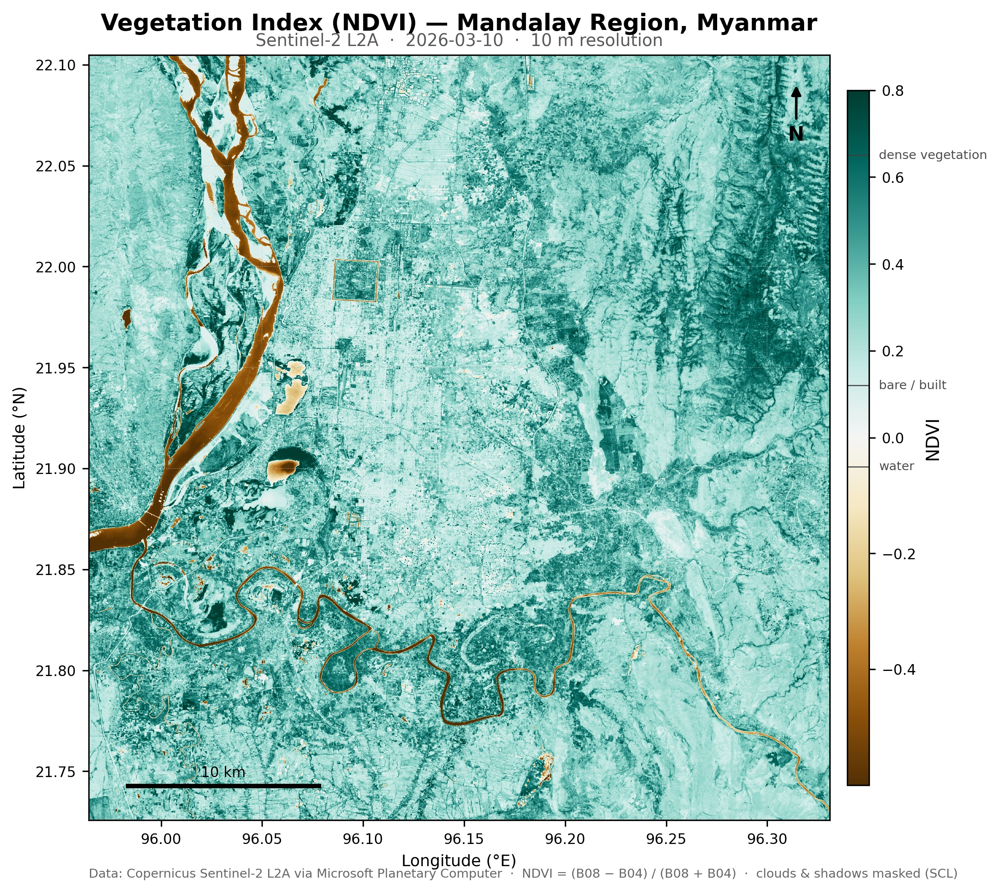

# Sentinel-2 NDVI from Microsoft Planetary Computer

Select the best available Sentinel-2 Level-2A scene for a bounding box from
[Microsoft Planetary Computer](https://planetarycomputer.microsoft.com/),
compute the Normalized Difference Vegetation Index (NDVI), and export a
publication-ready JPEG map together with the underlying GeoTIFFs.



*Example: Mandalay Region, Myanmar — Sentinel-2C, 10 Mar 2026, 0.00% cloud
cover, mean NDVI 0.31. The Irrawaddy and Myitnge rivers read brown (negative),
the urban core and dry-season fallow read near-zero, and irrigated cropland and
the Shan foothill forests read deep green; the square outline of the Mandalay
Palace moat is visible near the centre.*

## How it works

1. **Scene selection** — Queries the `sentinel-2-l2a` STAC collection for
   scenes whose data footprint *fully contains* the requested bounding box and
   whose radiometric degradation (`s2:degraded_msi_data_percentage`) is
   negligible. Among those it keeps every scene within a small tie-band of the
   minimum scene cloud cover, then chooses the **most recent** of them. This
   favours a fresh, cloud-free, complete-coverage scene rather than blindly
   taking the single lowest-cloud image.
2. **Band retrieval** — Performs windowed reads of the Cloud-Optimized
   GeoTIFF (COG) assets clipped to the bounding box: Red (`B04`, 10 m), NIR
   (`B08`, 10 m), and the Scene Classification Layer (`SCL`, 20 m, resampled
   onto the 10 m grid so masks align pixel-for-pixel). Only the pixels covering
   the AOI are downloaded, not the full 100×100 km tile.
3. **Radiometric correction** — For processing baseline ≥ 04.00, Sentinel-2
   L2A stores bottom-of-atmosphere reflectance with a **+1000 DN offset**; the
   script removes it before forming the ratio. Skipping this step biases NDVI
   low, so it is applied automatically based on the scene's
   `s2:processing_baseline`.
4. **Cloud & shadow masking** — Pixels flagged in the SCL band as cloud
   shadow (3), cloud medium probability (8), cloud high probability (9), or thin
   cirrus (10) are masked out, as are scene nodata pixels. Cloud cover *inside
   the AOI* is re-measured from SCL and reported (0.00% for the example scene).
5. **NDVI & rendering** — Computes `NDVI = (B08 − B04) / (B08 + B04)`,
   reprojects to EPSG:4326, crops to the exact bounding box, and writes both a
   GeoTIFF and a publication map. The map uses the colorblind-safe diverging
   ColorBrewer **BrBG** colormap with its neutral midpoint pinned at NDVI = 0,
   plus a labelled colorbar, lat/lon graticule, 10 km scale bar, north arrow,
   and a data-provenance credit line.

## Installation

```bash
pip install -r requirements.txt
```

Requires Python 3.9+. No Planetary Computer account or API key is needed — the
script uses the `planetary-computer` package to sign public asset URLs at
request time.

## Usage

```bash
python sentinel2_ndvi.py
```

The script is configured by the constants at the top of `sentinel2_ndvi.py`.
To run it for a different area or time window, edit these and re-run:

| Constant | Meaning | Default |
|---|---|---|
| `BBOX` | Area of interest, WGS84 lon/lat `[W, S, E, N]` | Mandalay Region |
| `SEARCH_WINDOW` | STAC `datetime` range to search | `2025-07-01/2026-07-03` |
| `MAX_SCENE_CLOUD` | Upper bound on scene cloud cover (%) for the STAC pre-filter | `10.0` |
| `CLOUD_TIE_BAND` | Scenes within this many % of the minimum cloud cover tie, and the most recent wins | `0.5` |
| `MAX_DEGRADED` | Ceiling on `s2:degraded_msi_data_percentage` (%) | `0.5` |
| `SCL_CLOUD_CLASSES` | SCL classes masked as cloud/shadow/cirrus | `(3, 8, 9, 10)` |
| `DATA_DIR` / `EXAMPLES_DIR` | Output directories | `data` / `examples` |

On each run the script prints the selected scene ID, acquisition date, MGRS
tile, scene cloud cover, degraded-data percentage, processing baseline, the
BOA offset applied, cloud/shadow fraction inside the AOI, and the NDVI
min/mean/max.

## Outputs

Running the pipeline produces (with `<date>` = the scene acquisition date,
e.g. `20260310`):

| File | Description |
|---|---|
| `data/S2_<date>_B04.tif` | Red band (B04), clipped to the AOI, native UTM |
| `data/S2_<date>_B08.tif` | NIR band (B08), clipped to the AOI, native UTM |
| `data/S2_<date>_SCL.tif` | Scene Classification Layer, resampled to 10 m |
| `data/NDVI_<date>.tif` | NDVI raster, `float32`, EPSG:4326, clouds masked (NaN) |
| `examples/NDVI_Mandalay_<date>.jpg` | Publication-ready NDVI map, 300 dpi |

The `data/*.tif` rasters are ignored by `.gitignore` (they are large and
regenerable); the example JPEG in `examples/` is tracked.

## Interpreting NDVI

NDVI is a normalized ratio in the range −1 to +1 that contrasts the strong NIR
reflectance of healthy vegetation against its low red reflectance:

| NDVI range | Typical surface |
|---|---|
| < 0 | Open water |
| 0.0 – 0.2 | Bare soil, rock, built-up / impervious surfaces |
| 0.2 – 0.5 | Sparse vegetation, grassland, shrub, senescent crops |
| > 0.5 | Dense, vigorous vegetation — forest, irrigated cropland |

Because the sensor sees only the surface, dry-season imagery (as in the example,
acquired in March at the end of the Myanmar dry season) shows lower values over
rain-fed farmland than a wet-season scene would.

## Reproducibility

Scene selection is deterministic for a given `SEARCH_WINDOW`: the query filters
to fully-covering, low-degradation scenes, ties on cloud cover within
`CLOUD_TIE_BAND`, and takes the most recent. For the default configuration this
resolves to:

```
S2C_MSIL2A_20260310T040611_R047_T46QHK_20260310T071610
  date 2026-03-10 · tile 46QHK · cloud 0.00% · degraded 0.020% · baseline 05.12
```

New acquisitions can change the "most recent" winner if you widen the search
window into a period with an even fresher cloud-free scene.

## Project structure

```
.
├── sentinel2_ndvi.py   # end-to-end pipeline (search → download → NDVI → map)
├── requirements.txt     # Python dependencies
├── examples/            # tracked example output map
│   └── NDVI_Mandalay_20260310.jpg
├── data/                # generated GeoTIFFs (git-ignored)
├── LICENSE
└── README.md
```

## Data source & attribution

- Sentinel-2 Level-2A data: Copernicus / ESA, distributed via
  [Microsoft Planetary Computer](https://planetarycomputer.microsoft.com/dataset/sentinel-2-l2a).
- BOA reflectance offset and SCL class definitions: ESA Sentinel-2 Products
  Specification / Level-2A Algorithm Theoretical Basis Document.
- Colormap: ColorBrewer `BrBG` (Cynthia Brewer), a colorblind-safe diverging
  scheme.

When using Copernicus data, please retain the attribution
"Contains modified Copernicus Sentinel data 2026."

## License

MIT — see [LICENSE](LICENSE).
